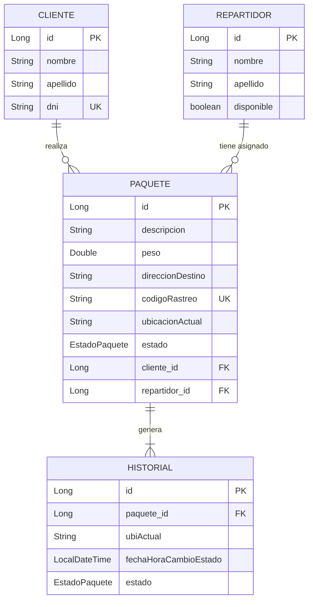

# API REST de Logística y Seguimiento de Paquetería

Esta aplicación es una API REST desarrollada con Spring Boot 4.1.0 y Java 21, diseñada para gestionar el flujo logístico de envíos de paquetería, registro de clientes invitados y seguimiento en tiempo real.

El proyecto implementa una arquitectura desacoplada y aplica buenas prácticas en la gestión de persistencia relacional con Hibernate y despliegue utilizando Docker.

---

## Modelo de Datos (Diagrama Entidad-Relación)

El sistema está estructurado en cuatro tablas conectadas de forma consistente. En la carpeta `/docs` se encuentra la imagen del modelo relacional:



---

## Tecnologías y Arquitectura

* **Backend:** Java 21 (JDK Eclipse Temurin), Spring Boot 4.1.0 (Spring Data JPA, Bean Validation).
* **Base de Datos:** H2 en memoria configurada en modo de compatibilidad MySQL (Consola activa en `/h2-console`).
* **Inyección de Dependencias:** Gestión mediante constructores implícitos utilizando la anotación `@RequiredArgsConstructor` de Lombok sobre propiedades `private final`.
* **Documentación:** Swagger UI. El DTO `PaqueteCrearDTO` incluye configuraciones de esquema para pre-cargar datos de prueba al enviar un paquete y restringir la visibilidad de identificadores internos.

---

## Despliegue con Docker

La aplicación se encuentra empaquetada en un contenedor Docker, permitiendo su ejecución de forma aislada y sin dependencias del entorno local.

### Instrucciones de compilación y ejecución:

En la terminal de Windows o la propia terminal del IDE, se deben ejecutar los siguientes comandos:

1. Compilar el proyecto y generar el archivo ejecutable:
   ```bash
   cd logistica-api
   ./mvnw.cmd clean package -DskipTests
   ```
2. Construir la imagen de Docker:
   ```bash
   docker build -t logistica-api:v1 .
   ```
3. Ejecutar el contenedor en segundo plano (Mapeo del puerto 8080):
   ```bash
   docker run -d -p 8080:8080 --name contenedor-logistica logistica-api:v1
   ```

---

## Guía de Uso y Pruebas de Endpoints

Una vez iniciado el contenedor de Docker, el funcionamiento de la API puede ejecutarse mediante dos alternativas independientes:

### Opción A: Swagger UI (Desde el Navegador)
La documentación interactiva se encuentra disponible localmente en la siguiente dirección:
http://localhost:8080/swagger-ui/index.html

Flujo secuencial para validar la lógica de negocio:

1. `POST /api/paquetes`: Registra un paquete, evitando repetición de Cliente mediante su DNI. Genera un código de rastreo único (ej. `ENV-257628`) e inserta de forma automática el estado inicial `RECIBIDO` en el historial.


2. `GET /api/paquetes`: Lista todos los envíos registrados.


3. `PUT /api/paquetes/asignarRepartidor/{idPaquete}/{idRepartidor}`: Asigna un repartidor disponible de la base de datos al paquete enviado.


4. `PUT /api/paquetes/actualizarEstado/{idPaquete}/estado`: Actualiza el estado y ubicación del paquete. Cada ejecución guarda un registro cronológico en el historial de dicho paquete.


5. `GET /api/paquetes/historial/{codigoRastreo}`: Obtiene el historial del paquete mediante su código de rastreo.


6. `GET /api/paquetes/dni/{dni}`: Recupera exclusivamente los paquetes asociados al DNI de un cliente específico.

### Opción B: Colección de Postman
En la carpeta `/docs` del repositorio se incluye el archivo JSON correspondiente a la colección de endpoints, listo para ser importado en Postman y ejecutarlos.

---

### Consola H2 (Acceso a la Base de Datos)

Con el contenedor en ejecución, la consola de administración de la base de datos en memoria está disponible en:

http://localhost:8080/h2-console

Credenciales de conexión:

| Campo | Valor |
|---|---|
| JDBC URL | `jdbc:h2:mem:superdb;MODE=MySQL;DB_CLOSE_DELAY=-1` |
| User Name | `yarel` |
| Password | *(vacío)* |


---

## Licencia

Este proyecto está bajo la licencia MIT. Esto significa que cualquiera puede usar, copiar, modificar y distribuir este código libremente,
incluso con fines comerciales, siempre que se mantenga el aviso de copyright original. Ver el archivo `LICENSE` para el texto completo.